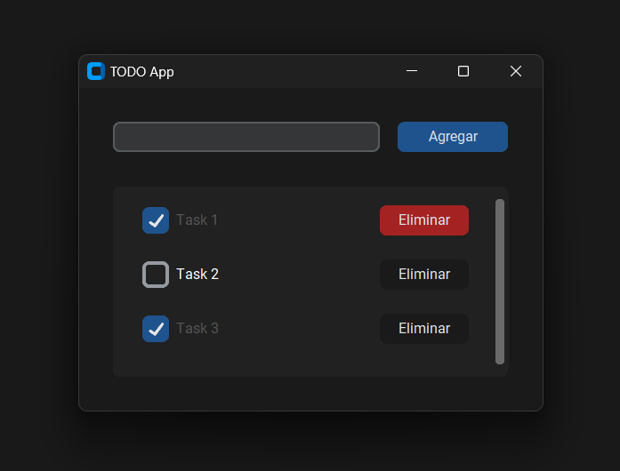

# TODO App

Esta es una aplicación de tareas pendientes (TODO) desarrollada en Python utilizando las bibliotecas `customtkinter` y `sqlite3`. La aplicación permite agregar, marcar como completadas y eliminar tareas.



## Requisitos

- Python 3.x
- Bibliotecas `customtkinter` y `sqlite3`

## Instalación
1. Clona este repositorio o descarga los archivos.
    ```bash
    git clone https://github.com/tu_usuario/todo_app.git
    ```
2. Instala las dependencias necesarias.
    ```bash
    pip install customtkinter
    ```

## Uso
Para ejecutar la aplicación, simplemente ejecuta el archivo principal:
```bash
python app.py
```

## Funcionalidades
### Agregar Tareas
Para agregar una nueva tarea, escribe la descripción de la tarea en el campo de entrada y haz clic en el botón "Agregar" o presiona la tecla "Enter".

### Listar Tareas
La lista de tareas se muestra en un marco desplazable. Cada tarea tiene una casilla de verificación para marcarla como completada o no completada.

### Marcar Tareas como Completadas
Para marcar una tarea como completada, haz clic en la casilla de verificación junto a la tarea. Esto actualizará el estado de la tarea en la base de datos.

### Eliminar Tareas
Para eliminar una tarea, haz clic en el botón "Eliminar" junto a la tarea correspondiente.

## Estructura del Código

* **App:** Clase principal de la aplicación que hereda de ctk.CTk.
    * **__init__:** Inicializa la interfaz, configura la ventana y crea la tabla de la base de datos.
    * **create_widgets:** Crea y configura los widgets de la interfaz.
    * **run_query:** Ejecuta consultas SQL en la base de datos.
    * **create_table:** Crea la tabla todo si no existe.
    * **add_todo:** Agrega una nueva tarea a la base de datos.
    * **render_todo_list:** Muestra la lista de tareas en la interfaz.
    * **completed_task:** Marca una tarea como completada o no completada.
    * **delete_task:** Elimina una tarea de la base de datos.

## Base de Datos
La aplicación utiliza una base de datos SQLite llamada todo.db con una tabla todo que tiene las siguientes columnas:
* **id:** Identificador único de la tarea.
* **created_at:** Timestamp de creación de la tarea.
* **description:** Descripción de la tarea.
* **completed:** Estado de la tarea (completada o no completada).